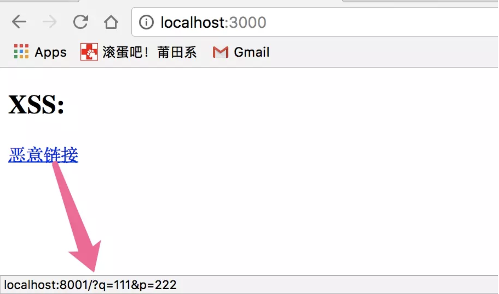
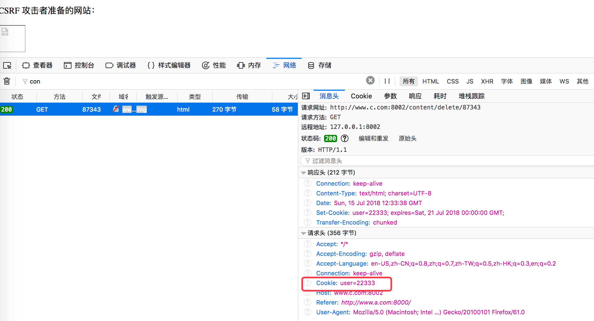

<!-- @import "[TOC]" {cmd="toc" depthFrom=1 depthTo=6 orderedList=false} -->

<!-- code_chunk_output -->

* [XSS](#xss)
	* [XSS 的类型](#xss-的类型)
		* [反射型](#反射型)
		* [存储型](#存储型)
		* [基于 DOM](#基于-dom)
	* [XSS 攻击的防范](#xss-攻击的防范)
		* [HttpOnly 防止劫取 Cookie](#httponly-防止劫取-cookie)
		* [输入检查](#输入检查)
		* [输出检查](#输出检查)
* [CSRF](#csrf)
	* [浏览器的 Cookie 策略](#浏览器的-cookie-策略)
	* [通过 Cookie 进行 CSRF 攻击](#通过-cookie-进行-csrf-攻击)
	* [CSRF 攻击的防范](#csrf-攻击的防范)
		* [验证码](#验证码)
		* [Referer Check](#referer-check)
		* [添加 token 验证](#添加-token-验证)
* [总结](#总结)

<!-- /code_chunk_output -->

在 Web 安全领域中，XSS 和 CSRF 是最常见的攻击方式。本文将会简单介绍 XSS 和 CSRF 的攻防问题。

- xss 原理上利用的是浏览器可以拼接成任意的 javascript，然后黑客拼接好 javascript 让浏览器自动地给服务器端发出多个请求（get、post 请求）。

- csrf 原理上利用的是网站服务器端所有参数都是可预先构造的原理，然后黑客拼接好具体请求 url，可以引诱你提交他构造好的请求。

# XSS

XSS，即 `Cross Site Script`，中译是跨站脚本攻击；其原本缩写是 CSS，但为了和层叠样式表(Cascading Style Sheet)有所区分，因而在安全领域叫做 XSS。

XSS 攻击是指攻击者在网站上注入恶意的客户端代码，通过恶意脚本对客户端网页进行篡改，从而在用户浏览网页时，对用户浏览器进行控制或者获取用户隐私数据的一种攻击方式。

攻击者对客户端网页注入的恶意脚本一般包括 JavaScript，有时也会包含 HTML 和 Flash。有很多种方式进行 XSS 攻击，但它们的共同点为：将一些隐私数据像 cookie、session 发送给攻击者，将受害者重定向到一个由攻击者控制的网站，在受害者的机器上进行一些恶意操作。

## XSS 的类型

XSS 攻击可以分为 3 类：**反射型（非持久型）、存储型（持久型）、基于 DOM**。

### 反射型

反射型 XSS 只是简单地把用户输入的数据 “反射” 给浏览器，这种攻击方式往往需要攻击者诱使用户点击一个恶意链接，或者提交一个表单，或者进入一个恶意网站时，注入脚本进入被攻击者的网站。

看一个示例。我先准备一个如下的静态页：



恶意链接的地址指向了 `localhost:8001/?q=111&p=222`。然后，我再启一个简单的 Node 服务处理恶意链接的请求：

```js
const http = require("http");
function handleReequest(req, res) {
  res.setHeader("Access-Control-Allow-Origin", "*");
  res.writeHead(200, { "Content-Type": "text/html; charset=UTF-8" });
  res.write('<script>alert("反射型 XSS 攻击")</script>');
  res.end();
}

const server = new http.Server();
server.listen(8001, "127.0.0.1");
server.on("request", handleReequest);
```

当用户点击恶意链接时，页面跳转到攻击者预先准备的页面，会发现在攻击者的页面执行了 js 脚本：


这样就产生了反射型 XSS 攻击。攻击者可以注入任意的恶意脚本进行攻击，可能注入恶作剧脚本，或者注入能获取用户隐私数据(如 cookie)的脚本，这取决于攻击者的目的。

### 存储型

存储型 XSS 会把用户输入的数据 "存储" 在服务器端，当浏览器请求数据时，脚本从服务器上传回并执行。这种 XSS 攻击具有很强的**稳定性**。

比较常见的一个场景是攻击者在社区或论坛上写下一篇包含恶意 JavaScript 代码的文章或评论，文章或评论发表后，所有访问该文章或评论的用户，都会在他们的浏览器中执行这段恶意的 JavaScript 代码。

举一个示例。

先准备一个输入页面：

```html
<input type="text" id="input" />
<button id="btn">Submit</button>

<script>
  const input = document.getElementById("input");
  const btn = document.getElementById("btn");

  let val;

  input.addEventListener(
    "change",
    e => {
      val = e.target.value;
    },
    false
  );

  btn.addEventListener(
    "click",
    e => {
      fetch("http://localhost:8001/save", {
        method: "POST",
        body: val
      });
    },
    false
  );
</script>
```

启动一个 Node 服务监听 save 请求。为了简化，用一个变量来保存用户的输入：

```js
const http = require("http");

let userInput = "";

function handleReequest(req, res) {
  const method = req.method;
  res.setHeader("Access-Control-Allow-Origin", "*");
  res.setHeader("Access-Control-Allow-Headers", "Content-Type");

  if (method === "POST" && req.url === "/save") {
    let body = "";
    req.on("data", chunk => {
      body += chunk;
    });

    req.on("end", () => {
      if (body) {
        userInput = body;
      }
      res.end();
    });
  } else {
    res.writeHead(200, { "Content-Type": "text/html; charset=UTF-8" });
    res.write(userInput);
    res.end();
  }
}

const server = new http.Server();
server.listen(8001, "127.0.0.1");

server.on("request", handleReequest);
```

当用户点击提交按钮将输入信息提交到服务端时，服务端通过 `userInput` 变量保存了输入内容。当用户通过 `http://localhost:8001/${id}` 访问时，服务端会返回与 id 对应的内容(本示例简化了处理)。如果用户输入了恶意脚本内容，则其他用户访问该内容时，恶意脚本就会在浏览器端执行：


### 基于 DOM

基于 DOM 的 XSS 攻击是指通过恶意脚本修改页面的 DOM 结构，是纯粹发生在客户端的攻击。

看如下代码：

```html
<h2>XSS:</h2>
<input type="text" id="input" />
<button id="btn">Submit</button>
<div id="div"></div>
<script>
  const input = document.getElementById("input");
  const btn = document.getElementById("btn");
  const div = document.getElementById("div");

  let val;

  input.addEventListener(
    "change",
    e => {
      val = e.target.value;
    },
    false
  );

  btn.addEventListener(
    "click",
    () => {
      div.innerHTML = `<a href=${val}>testLink</a>`;
    },
    false
  );
</script>
```

点击 `Submit` 按钮后，会在当前页面插入一个链接，其地址为用户的输入内容。如果用户在输入时构造了如下内容：

```
'' onclick=alert(/xss/)
```

用户提交之后，页面代码就变成了：

```html
<a href onlick="alert(/xss/)">testLink</a>
```

此时，用户点击生成的链接，就会执行对应的脚本：

## XSS 攻击的防范

现在主流的浏览器内置了防范 XSS 的措施，例如 CSP。但对于开发者来说，也应该寻找可靠的解决方案来防止 XSS 攻击。

### HttpOnly 防止劫取 Cookie

`HttpOnly` 最早由微软提出，至今已经成为一个标准。浏览器将禁止页面的 `Javascript` 访问带有 `HttpOnly` 属性的 `Cookie`。

上文有说到，攻击者可以通过注入恶意脚本获取用户的 `Cookie` 信息。通常 `Cookie` 中都包含了用户的登录凭证信息，攻击者在获取到 `Cookie` 之后，则可以发起 `Cookie` 劫持攻击。所以，严格来说，`HttpOnly` 并非阻止 `XSS` 攻击，而是能阻止 `XSS` 攻击后的 `Cookie` 劫持攻击。

### 输入检查

**不要相信用户的任何输入。** 对于用户的任何输入要进行检查、过滤和转义。建立可信任的字符和 HTML 标签白名单，对于不在白名单之列的字符或者标签进行过滤或编码。

在 XSS 防御中，输入检查一般是检查用户输入的数据中是否包含 `<`，`>` 等特殊字符，如果存在，则对特殊字符进行过滤或编码，这种方式也称为 `XSS Filter`。

而在一些前端框架中，都会有一份 decodingMap， 用于对用户输入所包含的特殊字符或标签进行编码或过滤，如 `<`，`>`，`script`，防止 XSS 攻击：

```js
// vuejs 中的 decodingMap
// 在 vuejs 中，如果输入带 script 标签的内容，会直接过滤掉
const decodingMap = {
  "&lt;": "<",
  "&gt;": ">",
  "&quot;": '"',
  "&amp;": "&",
  "&#10;": "\n"
};
```

### 输出检查

用户的输入会存在问题，服务端的输出也会存在问题。一般来说，除富文本的输出外，在变量输出到 `HTML` 页面时，可以使用编码或转义的方式来防御 `XSS` 攻击。例如利用 [sanitize-html](https://github.com/punkave/sanitize-html) 对输出内容进行有规则的过滤之后再输出到页面中。

# CSRF

CSRF，即 `Cross Site Request Forgery`，中译是跨站请求伪造，是一种劫持受信任用户向服务器发送非预期请求的攻击方式。

通常情况下，`CSRF` 攻击是攻击者借助受害者的 `Cookie` 骗取服务器的信任，可以在受害者毫不知情的情况下以受害者名义伪造请求发送给受攻击服务器，从而在并未授权的情况下执行在权限保护之下的操作。

在举例子之前，先说说浏览器的 Cookie 策略。

## 浏览器的 Cookie 策略

`Cookie` 是服务器发送到用户浏览器并保存在本地的一小块数据，它会在浏览器下次向同一服务器再发起请求时被携带并发送到服务器上。`Cookie` 主要用于以下三个方面：

- 会话状态管理（如用户登录状态、购物车、游戏分数或其它需要记录的信息）
- 个性化设置（如用户自定义设置、主题等）

而浏览器所持有的 `Cookie` 分为两种：

- `Session Cookie`(会话期 Cookie)：会话期 Cookie 是最简单的 `Cookie`，它不需要指定过期时间（`Expires`）或者有效期（`Max-Age`），它仅在会话期内有效，浏览器关闭之后它会被自动删除。
- `Permanent Cookie`(持久性 `Cookie`)：与会话期 `Cookie` 不同的是，持久性 Cookie 可以指定一个特定的过期时间（Expires）或有效期（`Max-Age`）。

```
res.setHeader('Set-Cookie', ['mycookie=222', 'test=3333; expires=Sat, 21 Jul 2018 00:00:00 GMT;']);
```

上述代码创建了两个 `Cookie`：mycookie 和 test，前者属于会话期 `Cookie`，后者则属于持久性 `Cookie`。当我们去查看 `Cookie` 相关的属性时，不同的浏览器对会话期 Cookie 的 `Expires` 属性值会不一样

此外，每个 `Cookie` 都会有与之关联的域，这个域的范围一般通过 `domain` 属性指定。如果 Cookie 的域和页面的域相同，那么我们称这个 Cookie 为第一方 Cookie（first-party cookie），如果 Cookie 的域和页面的域不同，则称之为第三方 Cookie（third-party cookie）。一个页面包含图片或存放在其他域上的资源（如图片）时，第一方的 Cookie 也只会发送给设置它们的服务器。

## 通过 Cookie 进行 CSRF 攻击

假设有一个 bbs 站点：`http://www.c.com`，当登录后的用户发起如下 GET 请求时，会删除 ID 指定的帖子：

```
http://www.c.com:8002/content/delete/:id
```

如发起 `http://www.c.com:8002/content/delete/87343` 请求时，会删除 `id` 为 `87343` 的帖子。当用户登录之后，会设置如下 `cookie`：

```
res.setHeader('Set-Cookie', ['user=22333; expires=Sat, 21 Jul 2018 00:00:00 GMT;']);
```


user 对应的值是用户 ID。然后构造一个页面 A：

```html
<p>CSRF 攻击者准备的网站：</p>

```

页面 A 使用了一个 `img` 标签，其地址指向了删除用户帖子的链接：


可以看到，当登录用户访问攻击者的网站时，会向 `www.c.com` 发起一个删除用户帖子的请求。此时若用户在切换到 `www.c.com` 的帖子页面刷新，会发现 ID 为 `87343` 的帖子已经被删除。

由于 `Cookie` 中包含了用户的认证信息，当用户访问攻击者准备的攻击环境时，攻击者就可以对服务器发起 `CSRF` 攻击。在这个攻击过程中，攻击者借助受害者的 `Cookie` 骗取服务器的信任，但并不能拿到 `Cookie`，也看不到 `Cookie` 的内容。而对于服务器返回的结果，由于浏览器同源策略的限制，攻击者也无法进行解析。因此，攻击者无法从返回的结果中得到任何东西，他所能做的就是给服务器发送请求，以执行请求中所描述的命令，在服务器端直接改变数据的值，而非窃取服务器中的数据。

但若 CSRF 攻击的目标并不需要使用 `Cookie`，则也不必顾虑浏览器的 `Cookie` 策略了。

## CSRF 攻击的防范

当前，对 CSRF 攻击的防范措施主要有如下几种方式。

### 验证码

验证码被认为是对抗 CSRF 攻击最简洁而有效的防御方法。

从上述示例中可以看出，CSRF 攻击往往是在用户不知情的情况下构造了网络请求。而验证码会强制用户必须与应用进行交互，才能完成最终请求。因为通常情况下，验证码能够很好地遏制 CSRF 攻击。

但验证码并不是万能的，因为出于用户考虑，不能给网站所有的操作都加上验证码。因此，验证码只能作为防御 CSRF 的一种辅助手段，而不能作为最主要的解决方案。

### Referer Check

根据 HTTP 协议，在 HTTP 头中有一个字段叫 Referer，它记录了该 HTTP 请求的来源地址。通过 `Referer Check`，可以检查请求是否来自合法的"源"。

比如，如果用户要删除自己的帖子，那么先要登录 `www.c.com`，然后找到对应的页面，发起删除帖子的请求。此时，`Referer` 的值是 `http://www.c.com`；当请求是从 `www.a.com` 发起时，`Referer` 的值是 `http://www.a.com` 了。因此，要防御 CSRF 攻击，只需要对于每一个删帖请求验证其 `Referer` 值，如果是以 `www.c.com`开头的域名，则说明该请求是来自网站自己的请求，是合法的。如果 `Referer` 是其他网站的话，则有可能是 CSRF 攻击，可以拒绝该请求。

针对上文的例子，可以在服务端增加如下代码：

```js
if (req.headers.referer !== "http://www.c.com:8002/") {
  res.write("csrf 攻击");
  return;
}
```


`Referer Check` 不仅能防范 CSRF 攻击，另一个应用场景是 **"防止图片盗链"**。

### 添加 token 验证

CSRF 攻击之所以能够成功，是因为攻击者可以完全伪造用户的请求，该请求中所有的用户验证信息都是存在于 `Cookie` 中，因此攻击者可以在不知道这些验证信息的情况下直接利用用户自己的 `Cookie` 来通过安全验证。要抵御 `CSRF`，关键在于在请求中放入攻击者所不能伪造的信息，并且该信息不存在于 `Cookie` 之中。可以在 `HTTP` 请求中以参数的形式加入一个随机产生的 `token`，并在服务器端建立一个拦截器来验证这个 `token`，如果请求中没有 `token` 或者 `token` 内容不正确，则认为可能是 `CSRF` 攻击而拒绝该请求。

# 总结

本文主要介绍了 XSS 和 CSRF 的攻击原理和防御措施。当然，在 Web 安全领域，除了这两种常见的攻击方式，也存在这 SQL 注入等其它攻击方式，这不在本文的讨论范围之内，如果你对其感兴趣，可以阅读 SQL 注入技术专题的专栏详细了解相关信息。最后，总结一下 XSS 攻击和 CSRF 攻击的常见防御措施：

1. 防御 XSS 攻击

   - HttpOnly 防止劫取 Cookie
   - 用户的输入检查
   - 服务端的输出检查

2. 防御 CSRF 攻击
   - 验证码
   - Referer Check
   - Token 验证

参考资料
[Cross-site scripting](https://developer.mozilla.org/zh-CN/docs/Glossary/Cross-site_scripting)
[CSRF 攻击的应对之道](https://www.ibm.com/developerworks/cn/web/1102_niugang_csrf/index.html)
《白帽子讲 Web 安全》

[文章来源](https://github.com/dwqs/blog/issues/68)
